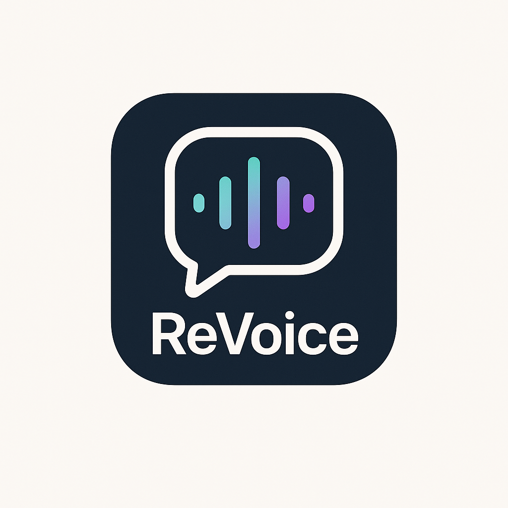

# ReVoice

<!-- LOGO PLACEHOLDER -->
<p align="center">
  
</p>

<p align="center">
  <b>Transform your spoken thoughts into perfectly crafted messages for any audience or tone.</b><br>
  <i>Voice-first, privacy-first, and powered by AI.</i>
</p>

<p align="center">
  <a href="https://github.com/nickdnj/revoice/actions/workflows/ci.yml"></a>
  <a href="LICENSE"></a>
</p>

---

## 🚀 Features
- **Voice Capture**: Tap-to-record, live waveform, on-device transcription
- **Transcript Review**: Edit and clean up before processing
- **Tone Transformation**: Choose from preset tone styles (Gen Z, Boomer, Professional, etc.)
- **AI Message Refinement**: Chat interface for iterative editing, commands like "shorter," "add warmth"
- **Output**: Copy, share, or save messages with tags and history
- **Session Management**: View, tag, favorite, and search past messages
- **Privacy-First**: All processing is local by default; API keys stored securely

---

## 📱 Screenshots
<!-- Add screenshots or GIFs here -->
<p align="center">
  
  
  
</p>

---

## 🎬 Demo Video
<!-- Add a link to a demo video if available -->
[Watch the demo](#)

---

## 🛠️ Installation & Quick Start

### Prerequisites
- macOS with Xcode 15 or later
- iOS 17+ device or simulator
- (Optional) OpenAI API key for advanced AI features

### Steps
1. **Clone the repo:**
   ```sh
   git clone https://github.com/nickdnj/revoice.git
   cd revoice
   ```
2. **Open in Xcode:**
   - Open the `ios/` folder in Xcode.
3. **Install dependencies:**
   - If using CocoaPods/SwiftPM, run the appropriate install command (see `/ios/README.md`).
4. **Configure API Keys:**
   - Add your OpenAI API key in the app’s Settings screen (optional for online features).
5. **Build & Run:**
   - Select your device/simulator and hit <kbd>Run</kbd>.

---

## ✨ Usage
1. Tap the mic button to record your message.
2. Review and edit the transcript.
3. Select a tone (Gen Z, Boomer, Professional, etc.).
4. Refine with AI chat commands ("shorter", "add warmth").
5. Copy, share, or save your message.

---

## 🏗️ Architecture
- **iOS App:** Swift & SwiftUI
- **Voice & TTS:** Apple Speech framework (on-device), ElevenLabs (optional)
- **AI Services:** OpenAI GPT-4o/Claude via HTTPS API
- **Storage:** Local (Core Data/FileManager), Keychain for API keys
- **No custom backend**

For full details, see the [Software Architecture Document](docs/SAD.md).

---

## 📚 Documentation
- [Product Requirements (PRD)](docs/PRD.md)
- [Software Architecture (SAD)](docs/SAD.md)
- [UX Design (UXD)](docs/UXD.md)

---

## 🤝 Contributing
Pull requests are welcome! Please:
- Read the docs in `/docs`
- Follow the architecture and UX guidelines
- For major changes, open an issue first to discuss what you’d like to change
- See [CONTRIBUTING.md](CONTRIBUTING.md) for more info (coming soon)

---

## 📄 License
[MIT](LICENSE)

---

## 🙏 Credits
- Product, architecture, and UX docs: see `/docs`
- Built by Nick DeMarco and contributors
